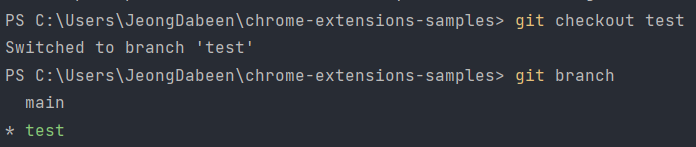

# git add 파일/폴더

##

우리는 그동안 `git add .` 을 통해 변경된 모든 파일을 Staging Area로 이동을 했습니다.

하지만 온점(.) 대신 파일 이름을 작성하면 특정 파일 / 특정 폴더에 변경된 파일들만 Staging Area로 이동할 수 있습니다.

한 번 아래 내용을 따라해봅시다.

저는 tutorial 폴더 안에 있는 focus-mode 폴더의 background.js, focus-mode.css에 코드를 아무렇게 수정하고, 마찬가지로 tutorial 폴더 안에 있는 hello-world 폴더의 hello.html, popup.js에 코드를 아무렇게 수정을 해보겠습니다.

이후 git status를 통해 확인하면 아래와 같이 나옵니다.

<figure><figcaption></figcaption></figure>

여기서 focus-mode는 하나씩 add를 사용해봅시다.

위 사진에 나와있는 것처럼 `git add tutorials/focus-mode/background.js` 를 실행합니다. 참고로 `git status` 를 해서 변경된 파일 경로를 복사하여 `git add 붙여넣기` 를 하는게 편합니다.

<figure><figcaption></figcaption></figure>

마찬가지로 `focus-mode.css` 도 `git add` 를 사용하여 수정해봅시다.

<figure><figcaption></figcaption></figure>

이번엔 hello-world 파일에서 변경된 파일인 hello.html과 popup.js를 한 번에 add 해봅시다.

이런 경우에는 `git add tutorials/hello-world` 를 입력하면 됩니다.

<figure><figcaption></figcaption></figure>

이렇게 hello-world의 모든 파일이 Staging Area로 이동한 것을 확인할 수 있습니다.


해당 내용을 그대로 유지한 상태로 다음 장으로 넘어가세요

