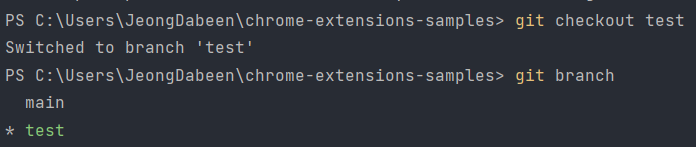

# git fork, git clone

&#x20;실습은 아래 리포지토리를 토대로 연습하겠습니다.



### 1. Fork

Fork는 다른 사람의 리포지토리를 그대로 복제해서 가져오는 기능입니다.

복제한 리포지토리는 이제 원본 리포지토리랑 분리가 됐기 때문에 Fork한 리포지토리에 코드 수정을 해도 원본 리포지토리에 영향을 주지 않습니다.

<figure><figcaption></figcaption></figure>

링크에 들어가면 위와 같은 페이지가 나옵니다.

해당 페이지는 진짜 오픈소스 리포지토리에서 실습을 하는게 아니라 koala-eat-eucalyptus라는 조직에 fork를 한 리포지토리입니다. 그래서 여기에서 코드를 수정해도 전혀 문제가 없습니다.

<figure><figcaption></figcaption></figure>

여기서 Fork 버튼을 누릅니다.

<figure><figcaption></figcaption></figure>

Fork 버튼을 누르면 위 창이 나옵니다.

여기서 Owner만 자신의 아이디가 나오는지 확인하고, 제대로 나왔는지 확인했으면 초록색 Create fork 버튼을 클릭합니다.

<figure><figcaption></figcaption></figure>

이후 왼쪽 위를 확인해보면 맨 처음과는 다르게 빨간 박스가 자신의 아이디가 되어 있는 것을 확인할 수 있습니다. 여기까지 들어왔다면 정상적으로 진행했다는 것입니다.

